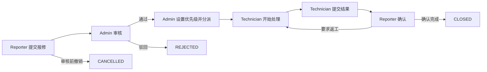
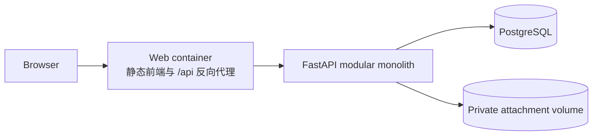

# CampusFix

CampusFix 是一个面向校园实体设施的 Web 报修与工单管理系统。系统围绕“提交、审核、分派、处理、确认”建立完整业务闭环，并通过角色授权、事件时间线和事务控制保证每张工单可追踪、可验证。

> **当前状态：P0 v1.0 需求与设计已冻结，基础运行环境正在交付。** 已有后端 Core、八表迁移、匿名种子脚本、Docker Compose 和基础测试。当前 API 提供 `/health`；登录和业务 Router、React 页面仍由相应任务实现，尚不能演示完整报修流程。

本项目是 JC2001 软件工程导论小组项目的 Web 概念验证（PoC），不代表学校正式维修服务。CampusFix 第一版仅处理校园实体设施故障；医疗、消防、报警及其他紧急安全事件应使用学校现有紧急渠道。

## 目录

- [业务流程](#业务流程)
- [用户角色](#用户角色)
- [P0 范围](#p0-范围)
- [系统设计](#系统设计)
- [仓库结构](#仓库结构)
- [运行与测试](#运行与测试)
- [项目文档](#项目文档)
- [开发协作](#开发协作)
- [许可证](#许可证)

## 业务流程



主流程中的工单状态依次为：

```text
SUBMITTED
→ PENDING_ASSIGNMENT
→ ASSIGNED
→ IN_PROGRESS
→ PENDING_CONFIRMATION
→ CLOSED
```

返工不增加长期状态。报修人要求返工后，系统写入 `REWORK_REQUESTED` 事件，工单回到 `IN_PROGRESS`。`CLOSED`、`REJECTED` 和 `CANCELLED` 均为 P0 终态。

## 用户角色

| 角色 | 主要能力 | 数据范围 |
| --- | --- | --- |
| Reporter | 创建报修、查看进度、补充公开留言、审核前撤销、确认完成、要求返工 | 自己创建的工单 |
| Technician | 查看任务、补充公开留言、开始处理、提交维修结果 | 当前分配给自己的工单及其关闭后的历史详情 |
| Admin | 查看全部工单、审核、驳回、分类、设置优先级、分派、维护地点和账户状态、查看统计 | 全部工单和管理数据 |

三类角色均使用种子数据创建的演示账户。P0 不提供自助注册、角色修改或管理员账户管理界面。

## P0 范围

### 核心功能

- 基于服务端会话的登录、退出和角色授权。
- 受控地点选择，以及地点的创建、编辑、启用和停用。
- 工单创建、可见列表、筛选、详情和审核前撤销。
- JPEG、PNG 和 WebP 现场图片与维修结果图片。
- 管理员审核、驳回、设置优先级和分派。
- 维修人员开始处理并提交维修说明和结果图片。
- 报修人确认完成或填写原因要求返工。
- 公开留言、管理员内部备注和只追加事件时间线。
- 按状态、类别、楼宇、积压、关闭耗时和近 30 日趋势统计。
- 数据库迁移、匿名种子数据、自动化测试和可复现的 Docker Compose 交付。

### P0 不包含

- IT 设备、校园网络、医疗、消防、报警及紧急安全事件。
- 自助注册、邮箱验证、密码找回和学校统一身份认证。
- 站内通知、邮件、短信、自动派单和重新分派。
- 管理员强制关闭、重新打开工单和疑似重复报修识别。
- 满意度评价、CSV 导出、自定义报表和实时聊天。
- 原生移动应用、支付、采购、供应商结算及生产级高可用。

完整范围和验收规则以 [CampusFix P0 需求与设计冻结基线](<docs/superpowers/specs/CampusFix P0 Requirements & Design Baseline.md>) 为准。

## 系统设计

CampusFix 采用模块化单体架构。前端和 API 使用同一站点来源，业务规则集中在后端，PostgreSQL 保存业务数据，附件存放在私有数据卷中。



### 技术栈

| 层级 | 选型 |
| --- | --- |
| 前端 | React、TypeScript、Vite |
| 前端路由与数据 | React Router、TanStack Query |
| 表单与校验 | React Hook Form、Zod |
| 后端 | FastAPI、SQLAlchemy 2.x、Alembic |
| 数据库 | PostgreSQL |
| 密码散列 | Argon2id |
| 测试 | Pytest、Vitest、React Testing Library、Playwright |
| 本地交付 | Docker Compose |

### 工程约束

- 后端同时校验有效会话、账户状态、角色、资源归属、工单状态和客户端版本。
- 只有 Workflow 模块可以修改工单状态；客户端不能通过通用 `PATCH status` 绕过状态机。
- 状态、版本、负责人、分派记录和事件日志按业务动作在同一事务中提交。
- 状态动作使用 `expected_version` 进行乐观并发控制，冲突返回 `409 Conflict`。
- 附件通过授权 API 访问，不从公共静态目录直接暴露。
- 前端路由保护和按钮隐藏只改善体验，不承担安全授权职责。
- 自动化测试需要覆盖越权访问、非法转换、重复请求、并发冲突和附件异常等失败语义。

## 仓库结构

```text
CampusFix/
├── backend/
│   ├── app/
│   │   ├── core/          # 配置、数据库、安全和统一错误基础设施
│   │   └── modules/       # 认证、用户、地点、工单、工作流等业务模块
│   ├── migrations/        # Alembic 数据库迁移
│   └── tests/             # 后端单元与集成测试
├── frontend/
│   └── src/
│       ├── api/           # API 客户端与契约类型
│       ├── app/           # 应用入口与全局装配
│       ├── components/    # 共享界面组件
│       ├── features/      # 按业务功能组织的前端模块
│       ├── routes/        # 页面与路由
│       └── test/          # 前端测试基础设施
├── tests/e2e/             # Playwright 端到端测试
└── docs/                  # 需求、设计、课程交付和用户文档
```

这些目录目前主要用于固定模块边界，不表示对应功能已经完成。

## 运行与测试

需要 Docker Engine / Docker Desktop，以及 Docker Compose v2.17 或更新版本。镜像固定为 Python 3.12.12、PostgreSQL 17.11、Nginx 1.28.0；Python 依赖固定在 `backend/requirements.lock` 和 `backend/requirements-dev.lock`。

在仓库根目录执行：

```bash
cp .env.example .env
```

编辑 `.env`：设置数据库密码、对应的 `DATABASE_URL`、至少 32 字符的随机 `SECRET_KEY` 和三项 `SEED_*_PASSWORD`。这些密码只用于虚构演示账户，不使用校园凭据。数据库密码在 URL 中含保留字符时需要 URL 编码。`.env` 不进入 Git。默认使用 `http://localhost:8080`；修改端口时同步修改 `ALLOWED_ORIGINS` 为浏览器实际访问的完整来源。

```bash
docker compose config --quiet
docker compose up --build -d --wait --wait-timeout 120
docker compose ps -a
curl --fail http://localhost:8080/health
docker compose exec -T api python -m app.seed
docker compose exec -T api python -m app.seed
```

启动依赖为 `db healthy → migrate 成功退出 → api healthy → web`。`migrate` 退出码为 0 是正常状态；`--wait` 等待服务就绪后再进行健康检查。Compose 重建 API 时同步重启 Web，使 Nginx 重新解析后端地址。种子首次创建 3 个账户和 3 个地点，第二次应输出 `0 users, 0 locations created`。重启后的数据库和附件分别保留在私有持久化卷，Web 不挂载附件卷。仅 Web 端口绑定到本机，API 和数据库通过 Compose 网络访问。

| 演示账户 | 角色 | 密码来源 |
| --- | --- | --- |
| `demo-reporter@example.invalid` | REPORTER | `SEED_REPORTER_PASSWORD` |
| `demo-technician@example.invalid` | TECHNICIAN | `SEED_TECHNICIAN_PASSWORD` |
| `demo-admin@example.invalid` | ADMIN | `SEED_ADMIN_PASSWORD` |

种子复用 Core 的 Argon2id 工具，仅新增缺失行；不会重设已有密码、启用已停用账户或修改已有角色。角色冲突会导致整个种子事务回滚。三角色真实 HTTP 登录需在 #47 的 Auth Router 接入后验收。

当前 Web 使用 `deploy/web/bootstrap` 中的基础环境占位页。#48 完成前端后，先按其依赖锁文件执行前端构建，将 `.env` 中 `FRONTEND_DIST` 改为 `frontend/dist`，然后执行 `docker compose up --build -d web`。Web 保留 SPA 路由并原样代理 `/api/`；前端 API 客户端使用相对路径 `/api`，Cookie 和 Origin 校验继续复用已有后端配置。

在现有四服务环境中运行后端测试：

```bash
docker compose -f docker-compose.yml -f deploy/docker-compose.test.yml build api
docker compose -f docker-compose.yml -f deploy/docker-compose.test.yml run --rm --no-deps api
```

测试覆盖 Core、接口契约、真实 PostgreSQL 迁移与种子。每项数据库测试创建并删除自己的 `campusfix_test_<随机值>` 数据库，测试账户需要 `CREATEDB` 权限；Compose 初始化的账户具备该权限。测试镜像和运行镜像分开，测试不启动新的业务 API。前端、业务权限和端到端测试随对应功能实现补充。

原生 Python 开发可使用 Python 3.12 与现有 PostgreSQL：

```bash
python3.12 -m venv .venv
.venv/bin/python -m pip install -r backend/requirements-dev.lock
cd backend
# 在当前 shell 配置 DATABASE_URL，连接原生 PostgreSQL 而非 Compose 的 db 主机。
../.venv/bin/alembic upgrade head
../.venv/bin/python -m app.seed
../.venv/bin/uvicorn app.main:app --host 127.0.0.1 --port 8000
```

原生模式的 `.env` 放在 `backend/`，或通过当前 shell 注入配置；种子需同样注入三项密码。运行集成测试前，设置 `CAMPUSFIX_TEST_DATABASE_URL` 为专用测试库 URL，然后在 `backend/` 执行 `../.venv/bin/python -m pytest -q`。未设置该变量时，数据库集成项会显示 skipped，不能作为 #45 的验收通过证据。迁移回滚只在可丢弃的测试库中执行 `alembic downgrade base`，再执行 `alembic upgrade head`。

排查启动问题使用 `docker compose logs migrate api db web`。停止用 `docker compose down`，会保留数据卷。需要清空虚构演示数据时才使用 `docker compose down --volumes`，该命令会删除数据库和附件卷。

#45 的数据模型、成员复用方式和验收边界见 [运行环境与数据层交接](docs/superpowers/handoffs/2026-10-02-runtime-storage-handoff.md)。

P0 完成需要满足冻结基线中的全部验收条件，包括三角色完整闭环、权限隔离、并发一致性、FR-01 至 FR-12 自动化测试映射，以及在全新环境中通过 Compose、迁移和种子脚本完成启动。

## 项目文档

| 文档 | 说明 |
| --- | --- |
| [P0 需求与设计冻结基线](<docs/superpowers/specs/CampusFix P0 Requirements & Design Baseline.md>) | P0 v1.0 已批准范围、业务规则、技术设计、API 契约和验收基线 |
| [产品需求文档](docs/CampusFix_PRD.md) | 产品目标、需求编号、用例和课程交付要求 |
| [项目 Proposal](docs/Proposal/CampusFix-Project-Proposal.pdf) | 项目提案 PDF |
| [团队分工表](docs/Team-Assignment.pdf) | 团队任务分工 PDF |
| [团队开发协作手册](<（必读）CampusFix-团队开发协作手册.md>) | Issue、分支、AI 协作、评审和交接流程 |
| [AI Agent 治理规则](AGENTS.md) | AI coding agent 的决策权限、范围边界和交付纪律 |

需求解释优先遵循：当前任务中已批准的人类决定、P0 冻结基线、PRD、已批准的 Issue 或 PR、现有契约与实现。README 用于提供项目入口和当前状态，不替代冻结基线。

## 开发协作

团队采用以下工作流：

```text
确认 Issue
→ 在已有分支树下开发
→ 实现并运行相关测试
→ 检查 git diff 和 git status
→ 提交 Pull Request
→ 至少一人 Review
→ 合并 main
```

每项工作应明确目标、范围外内容和验收方式。涉及 P0 范围、状态机、角色权限、公共 API、核心数据模型或数据库约束的变化，需要先更新并批准相应的 source of truth，再进入实现。

## 许可证

本项目采用 [MIT License](LICENSE)。
